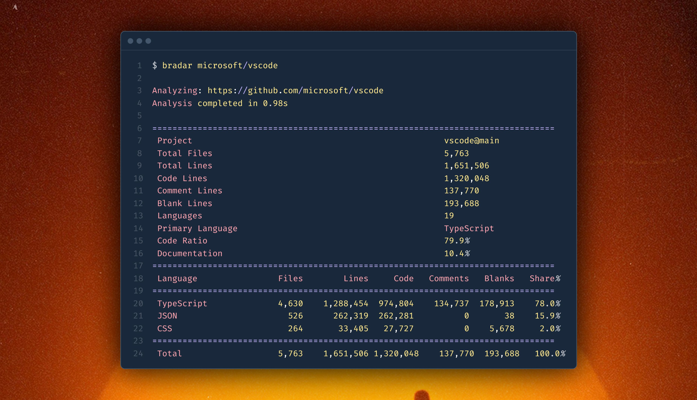

# Bytes Radar

[](https://github.com/zmh-program/bytes-radar/actions)
[](LICENSE)
[](https://crates.io/crates/bytes-radar)
[](https://www.rust-lang.org)
[](https://app.fossa.com/projects/git%2Bgithub.com%2Fzmh-program%2Fbytes-radar?ref=badge_shield)

[](https://deploy.workers.cloudflare.com/?url=https://github.com/zmh-program/bytes-radar)

Hyper-fast **CLOC** _(\*count lines of code)_ tool for remote repositories.



## Features

- Efficient remote repository analysis with async streaming and in-memory decompression, optimized for low memory usage (always <12MB runtime mem)
- Unified URL parsing for GitHub, GitLab, Bitbucket, Codeberg, SourceForge, Gitea and Azure DevOps
- Rule-based language detection supporting 150+ programming languages with [Tokei's Language Rules](https://github.com/XAMPPRocky/tokei/blob/master/languages.json)
- Real-time progress tracking with download speed, ETA and adaptive terminal UI
- Multiple output formats (Table, JSON, CSV, XML, YAML, TOML) with schema validation
- OAuth token management for private repository access
- Native binaries for Linux, macOS and Windows
- Experimental parallel processing and streaming analysis
- Extensive provider configuration with custom headers, credentials, and settings
- Advanced network configuration with proxy support and compression control
- Intelligent file filtering with customizable rules and .gitignore support

## Supported Platforms

| Platform           | URL Format                                | Example                                     |
| ------------------ | ----------------------------------------- | ------------------------------------------- |
| **GitHub**         | `user/repo`, `user/repo@branch`, full URL | `microsoft/vscode`, `torvalds/linux@master` |
| **GitLab**         | Full URL                                  | `https://gitlab.com/user/repo`              |
| **Bitbucket**      | Full URL                                  | `https://bitbucket.org/user/repo`           |
| **Codeberg**       | Full URL                                  | `https://codeberg.org/user/repo`            |
| **SourceForge**    | Full URL                                  | `https://sourceforge.net/user/repo`         |
| **Gitea**          | Full URL                                  | `https://gitea.example.com/user/repo`       |
| **Azure DevOps**   | Full URL                                  | `https://dev.azure.com/org/project`         |
| **Direct Archive** | tar.gz, tgz, zip URL                      | `https://example.com/archive.tar.gz`        |

## Installation

Download the latest binary from **[GitHub Releases](https://github.com/zmh-program/bytes-radar/releases)** or install via Cargo:

```bash
cargo install bytes-radar
```

## Usage

#### Basic Repo Analysis

```bash
bradar torvalds/linux # or https://github.com/torvalds/linux
```

#### Branch and Commit Targeting

Specify particular branches or commit hashes for analysis:

```bash
bradar microsoft/vscode@main # or https://github.com/microsoft/vscode/tree/main
bradar kubernetes/kubernetes@release-1.28 # or https://github.com/kubernetes/kubernetes/tree/release-1.28
```

#### Multi-Platform Repository Support

Analyze repositories from different Git hosting platforms:

```bash
bradar https://gitlab.com/gitlab-org/gitlab
bradar https://bitbucket.org/atlassian/stash
bradar https://codeberg.org/forgejo/forgejo
```

#### Provider Configuration

Configure provider-specific settings and authentication:

```bash
# GitHub Enterprise with custom API version
bradar --provider-setting github.api_version=2022-11-28 \
       --header "Accept=application/vnd.github.v3+json" \
       https://github.company.com/org/repo

# Multiple provider credentials
bradar --credential "github.token=ghp_xxx" \
       --credential "gitlab.token=glpat_xxx" \
       user/repo
```

#### Network Configuration

Configure network behavior and proxy settings:

```bash
# Using corporate proxy with custom timeout
bradar --proxy http://proxy.company.com:8080 \
       --timeout 600 \
       --max-redirects 5 \
       user/repo

# Enterprise setup with custom headers
bradar --header "X-Custom-Auth=token" \
       --allow-insecure \
       --use-compression false \
       https://git.company.com/repo
```

#### Output Format Configuration

Generate analysis results in structured data formats:

```bash
bradar -f json torvalds/linux
```

#### Performance and Output Control

Configure analysis behavior and output verbosity:

```bash
bradar --quiet --no-progress user/repo
bradar --timeout 600 --detailed large-org/massive-repo
```

## CLI Options

```bash
bradar [OPTIONS] <URL>

ARGUMENTS:
  <URL>  Repository URL to analyze (user/repo, user/repo@branch, or full URL)

OPTIONS:
  # Output Options
  -f, --format <FORMAT>        Output format [table|json|csv|xml|yaml|toml]
      --detailed              Show detailed file-by-file statistics
  -q, --quiet                Quiet mode - suppress progress and minimize output
      --no-progress          Disable progress bar
      --no-color             Disable colored output

  # Provider Configuration
      --provider-config <FILE>  Provider-specific configuration file
      --provider-setting <KEY=VALUE>  Set provider-specific setting
      --header <NAME=VALUE>    Add custom HTTP header
      --credential <KEY=VALUE> Set provider credential

  # Network Options
      --timeout <SECONDS>    Request timeout in seconds [default: 300]
      --max-redirects <COUNT> Maximum number of redirects [default: 10]
      --allow-insecure       Allow insecure HTTPS connections
      --user-agent <STRING>  Custom User-Agent string
      --use-compression     Enable HTTP compression [default: true]
      --proxy <URL>         Proxy URL for all requests
      --retry-count <COUNT>  Number of retry attempts [default: 3]

  # Filtering Options
      --aggressive-filter    Enable aggressive filtering for maximum performance
      --max-file-size <KB>  Maximum file size to process in KB [default: 102400]
      --min-file-size <BYTES> Minimum file size to process in bytes [default: 1]
      --include-tests       Include test directories in analysis
      --include-docs        Include documentation directories in analysis
      --include-hidden      Include hidden files and directories
      --exclude-pattern <PATTERN>  Exclude files matching this pattern (glob)
      --include-pattern <PATTERN>  Only include files matching this pattern (glob)

  # Language Options
      --language <LANG>     Only analyze files of specific language
      --exclude-language <LANG>  Exclude specific language from analysis

  # Analysis Options
      --ignore-whitespace   Ignore whitespace-only lines in code analysis
      --count-generated     Include generated files in analysis
      --max-line-length <LENGTH>  Maximum line length to consider [default: 0]

  # Debug and Logging
  -d, --debug              Enable debug output
      --trace              Enable trace-level logging
      --log-file <FILE>    Write logs to file

  # Advanced Options
      --threads <COUNT>     Number of worker threads (0 = auto) [default: 0]
      --memory-limit <MB>   Memory limit in MB (0 = unlimited) [default: 0]
      --cache-dir <DIR>    Directory for caching downloaded files
      --no-cache           Disable caching of downloaded files

  # Experimental Features
      --experimental-parallel    Enable experimental parallel processing
      --experimental-streaming  Enable experimental streaming analysis

  # General
  -v, --version           Print version
  -h, --help             Print help
```

See [CLI USAGE GUIDE](docs/CLI_USAGE.md) for more detailed usage examples and advanced configurations.

## Deployment

### Cloudflare Workers

[](https://deploy.workers.cloudflare.com/?url=https://github.com/zmh-program/bytes-radar)

> [!TIP]
> The Free Tier of Cloudflare Workers has a **20s request timeout limit** (wall time). Analysis of large repositories may fail due to this limitation. Consider upgrading to Cloudflare Workers Pro or using alternative methods for processing large repositories.

For detailed deployment instructions and API documentation, see [DEPLOYMENT GUIDE](docs/DEPLOYMENT.md).

## Contributing

We welcome contributions! Please see [CONTRIBUTING GUIDE](docs/CONTRIBUTING.md) for guidelines.

## License

[](https://app.fossa.com/projects/git%2Bgithub.com%2Fzmh-program%2Fbytes-radar?ref=badge_large)
